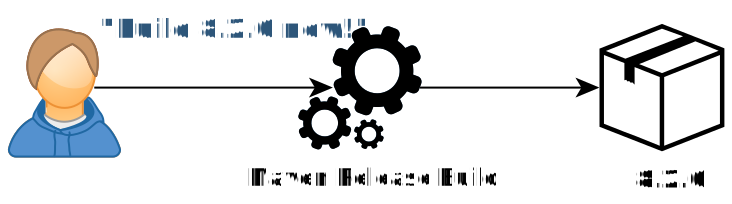
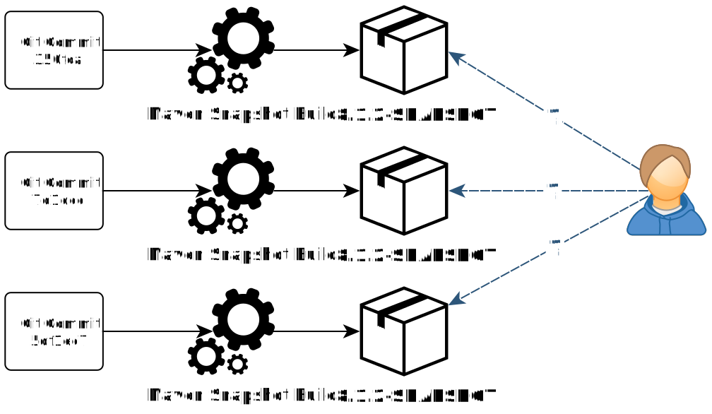
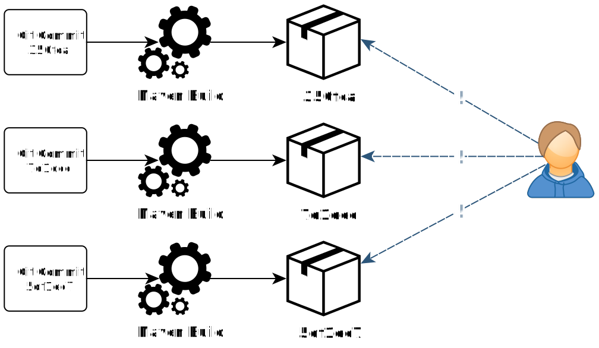

= phauer - Version Numbers for Continuous Delivery with Maven and Docker

(@ phauer.com) (mentve: '20-02-01)

[TIP]
====
A hozzászólásokban még találsz hasznos információt.
====

[NOTE]
====
Én alapvetően még a https://semver.org/[Semantic Versioning] híve vagyok, mert megfelelően kezelve információt hordoz
egy nem alapvetően LIB jellegű artifact-nál is. Vagy csak öreg vagyok... :D

Mindenesetre megfontolás és átgondolás társát képezi ez és ennek pár éve megjelent alternatívái, amelyek teljesen
kivezetik a verziókezelést a maven version részből.
====

https://phauer.com/2016/version-numbers-continuous-delivery-maven-docker/

Dealing with version numbers is an important challenge on the way to Continuous Delivery. The classical versioning
approach (“8.2.0”) and release workflow is inappropriate, because it can’t be automated properly. This post shows how we
can leverage the Git commit hash to get rid of manual workflows and automate the Continuous Delivery pipeline. At the
end, every build will produce an artifact which is potentially shippable. We’ll implement this solution with Maven and
Docker.

image::./images/featured-image-large.png[]

== Motivation

Let’s consider the principles of Continuous Delivery.

* “Every build is a potential release”
* “Eliminate manual bottlenecks”
* “Automate wherever possible”

That’s exactly what we like to achieve. But let’s take a look at some concrete problems with the typical Maven release
workflow and classical version numbers.

== No Automation

Typically, a commit triggers a snapshot build, which produces a snapshot artifact (“8.1.2-SNAPSHOT”). When the developer
feels that the software has reached a stable state, he triggers a dedicated release build. Therefore, he assigns a
version number (“8.2.0”) up front.

What are the drawbacks of this approach?

* We need to manually trigger a dedicated release workflow.
* The version number needs to be assigned manually by a human.
* Moreover, just by looking at the version number “8.2.0” it’s not clear, which commits are included in the artifact. We
  need a Git tag.

== Arbitrary Snapshots

Additionally, snapshots cause a lot of problems.

* Not traceable. We can’t say, which commits are included in the current snapshot artifact.
* Unreliable. The snapshot artifact can change from one second to another. This can easily lead to trouble.
* Error-Prone. It’s easy to override a snapshot accidentally (e.g. when creating a Git branch, but forgetting to change
  the version number in the pom. Building from the Git branch will override the develop snapshot.)

== Annoying Maven-Release-Plugin

Finally, the maven-release-plugin is also causing troubles:

* Overhead. The maven-release plugin runs 3 (!) full build and test cycles, manipulates the POM 2 times and creates 3
  Git revisions.
* Not isolated. The plugin can easily get in a mess when someone else commits changes during the release build.
* Not atomic. If something went wrong in the last step (e.g. during the artifact upload), we are facing an invalid
  state. We have to clean up the created Git tag, Git revisions and fix the wrong version in the pom manually.

== Solution: Leveraging the Git Commit Hash

We use the Git commit hash as the version number for the built artifact.

* Every built artifact has a machine-assigned unique number.
* Therefore, every artifact is potentially shippable. So there is no need for a dedicated release workflow anymore!
* => The delivery pipeline is significantly simplified and automated
* Traceable. It’s obvious, which commits are included.
* Reproducible. Just check out the revision and build the artifact again (assuming no snapshot dependencies).
* Basically, a Git tag is not necessary anymore.

== Implementation

Let’s integrate the proposed version naming in a Maven build. The example build produces a simple Spring Boot service as
a fat Jar. Additionally, we wrap the fat Jar in a Docker image and deploy the image instead of the Jar. The complete
sources can be found on Github.

Update 2019: I won’t recommend wrapping a fat jar into a Docker image anymore, because it’s a huge waste of storage,
bandwidth and time. For details, see this post.

To increase the human-readability, we prefix the Git commit hash with the commit timestamp. Hence, our version numbers
will look like this:

[source,]
----
format:  yyyyMMdd-HHmmss.abbreviatedCommitHash
example: 20160702-152019.75c54f5
----

== Use the Commit Hash as the Version Number

That’s the most important step. We use the git-commit-id-plugin. The plugin reads the commit hash and the commit
timestamp from the .git directory and makes it available in the pom via Maven properties.

[source,xml]
----
<plugin>
    <groupId>pl.project13.maven</groupId>
    <artifactId>git-commit-id-plugin</artifactId>
    <version>2.2.4</version>
    <executions>
        <execution>
            <phase>validate</phase>
            <goals>
                <goal>revision</goal>
            </goals>
        </execution>
    </executions>
    <configuration>
        <dateFormat>yyyyMMdd-HHmmss</dateFormat><!--  human-readable part of the version number -->
        <dotGitDirectory>${project.basedir}/.git</dotGitDirectory>
        <generateGitPropertiesFile>false</generateGitPropertiesFile><!-- somehow necessary. otherwise the variables are not available in the pom -->
    </configuration>
</plugin>
----

Next, we can define a Maven property for our version number that contains the commit timestamp and hash.

[source,xml]
----
<properties>
   <version.number>${git.commit.time}.${git.commit.id.abbrev}</version.number>
</properties>
----

Tip: Most likely, your IDE will argue that the properties `${git.commit.time}` and `${git.commit.id.abbrev}` can’t be
resolved. In IntelliJ IDEA, you can remove this message by adding the properties under Settings > Maven > Runner. An
empty value is sufficient to calm IDEA.

== Create a Docker Image and Tag the Image with the Version Number

Update 2019: Today, I recommend to use Google’s Jib plugin instead of the one from fabric8. Jib leverages Docker’s image
layering to significantly reduce the required size of each artifact. With Jib we could reduce the size of each artifact
from 80 MB to 1 MB! This is even more important, when you create a unique artifact with each commit as proposed in this
article. For details, see the post https://phauer.com/2019/no-fat-jar-in-docker-image/[‘Don’t Put Fat Jars into Docker
Containers’].

We use the docker-maven-plugin of io.fabric8 to create the image. The important part is the tagging. We create two tags.
One tag is named after the commit id (“20160702-153902.7c12eb5”) and one is named “latest”. The latest-tag will simplify
local testing.

[source,xml]
----
<plugin>
    <groupId>io.fabric8</groupId>
    <artifactId>docker-maven-plugin</artifactId>
    <version>0.21.0</version>
    <extensions>true</extensions>
    <configuration>
        <!-- a) use "docker login" up front to store the credentials on the local machine. -->
        <!-- or b) comment in the following snippet: -->
        <!--<authConfig>-->
            <!--<username>phauer</username>-->
            <!--<password>docker123</password>-->
        <!--</authConfig>-->
        <images>
            <image>
                <name>${docker.repository.name}:${version.number}</name>
                <alias>${project.artifactId}</alias>
                <build>
                    <from>openjdk:8-alpine</from>
                    <tags><!-- define additional tags for the image -->
                        <tag>latest</tag>
                    </tags>
                    <assembly>
                        <descriptorRef>artifact</descriptorRef>
                    </assembly>
                    <ports>
                        <port>8080</port>
                    </ports>
                    <cmd>
                        <shell>
                            java -jar /maven/${project.build.finalName}.jar
                        </shell>
                    </cmd>
                </build>
            </image>
        </images>
    </configuration>
    <executions>
        <execution>
            <id>build-docker-image</id>
            <phase>package</phase>
            <goals>
                <goal>build</goal>
            </goals>
        </execution>
        <execution>
            <id>push-docker-image-to-registry</id>
            <phase>deploy</phase>
            <goals>
                <goal>push</goal>
            </goals>
        </execution>
    </executions>
</plugin>
----

And add the following property:

[source,xml]
----
<docker.repository.name>phauer/${project.artifactId}</docker.repository.name>
----

Usage:

[source,]
----
> mvn package # creates a docker image and installs it to the local repository

> docker images
REPOSITORY                                                TAG                              IMAGE ID            CREATED             SIZE
phauer/versioning-continuous-delivery                     20160702-174649.28b5299          12d7a526c506        2 seconds ago       135.8 MB
phauer/versioning-continuous-delivery                     latest                           12d7a526c506        2 seconds ago       135.8 MB

> docker-compose up # starts the local image with the tag "latest"

> mvn deploy # pushes the image to the docker registry
----

The complete https://github.com/phauer/blog-related/blob/master/versioning-continuous-delivery/pom.xml[pom.xml] and
docker-compose.yml can be found on Github.

== What happens to the JAR and its Version Number?

The artifact of your build is the docker image; not the JAR anymore. That’s why you should disable the local
installation and deployment of the jar.

[source,xml]
----
<plugin>
    <artifactId>maven-install-plugin</artifactId>
    <configuration>
        <skip>true</skip> <!-- we push the container image to the local registry instead -->
    </configuration>
</plugin>

<plugin>
    <groupId>org.apache.maven.plugins</groupId>
    <artifactId>maven-deploy-plugin</artifactId>
    <configuration>
        <skip>true</skip> <!--  we push the image instead  -->
    </configuration>
</plugin>
----

Moreover, we are now versioning the docker image, not the JAR. So you don’t need to update the version in the pom.xml
anymore. Instead, set it to a fixed value.

[source,xml]
----
<groupId>de.philipphauer.blog</groupId>
<artifactId>versioning-continuous-delivery</artifactId>
<version>1.0.0-SNAPSHOT</version> <!-- doesn't matter anymore. so it will never be changed. -->
----

This approach works out quite well for us in practice. Moreover, using a (dynamic) property in the <version> tag may
lead to issues because the properties created by the git-commit-id-plugin can not be resolved for the
maven-install-plugin and the maven-deploy-plugin.

== Open Issues and Discussion

=== Git Tags for Deployed Artifacts

Sometimes it’s handy to have a dedicated Git tag to mark an artifact, which was really deployed. You are free to tag the
corresponding Git revision after deployment. You can do this either manually or integrate the tagging in your final
deploy process. The latter keeps the workflow automated.

=== Dealing with the Artifact Flood

As every build leads to a new artifact, we are facing a huge amount of artifacts in our repository. Hence, we have to
clean up.

* But how do we know which versions have been deployed? We don’t want to delete the artifact that is currently in
  production. So we have to maintain a list of deployed versions and skip them during clean up. We can achieve this for
  instance by using Git tags, which are created when the artifact is deployed (see above). But we can also save the
  version list wherever we like.
* Let’s be honest. Deleting old artifacts which have been in production a while ago is no problem. Have you ever rolled
  back to a 1-year-old artifact? Usually, you only need the current deployed artifact and its direct predecessor.

Update 2019: The amount of artifacts are less imporant than their size. If you wrap a fat jar into a docker image, each
new artifact will take about 80 MB. But we can easily reduce the size to 1 MB! How? By stop using fat jars in Docker
images which can be easily done with Google’s Jib plugin. For details, see the post ‘Don’t Put Fat Jars into Docker
Containers’.

=== Check for Snapshot Dependencies

The maven-release-plugin aborts the build, if it finds snapshot dependencies. That’s basically fine, because snapshot
dependencies prevent the reproducibility of the build. We are now lacking this check. However, I claim that this is no
big deal in practice.

* It happens rarely. Usually a developer pays attention and removes snapshot dependencies before he releases it.
* When we apply the proposed version concept also for our libraries, we have no snapshots at all.
* Even if our artifact contains snapshots, the snapshot is still bundled up within the artifact (fat Jar or Docker
  image). The artifact is saved in the registry, tested and finally deployed. Do we really need to reproduce the build
  if we have the built artifact in our registry?

=== Use Build Timestamp instead of Commit Hash

There are versioning proposals that use the timestamp of the build instead of the commit hash. But I prefer the commit
hash due to the following reasons:

* Obvious tracing of version numbers to commits.
* Basically, no Git tag necessary.
* Reproducible artifact based on given revision.

=== What about Libraries?

The covered approach makes sense for deployable projects. It’s cumbersome for libraries, because the version numbers are
less predictable. If you have in-house libraries I would recommend to stick to the traditional versioning pattern.

=== Is Docker Necessary for this Versioning Approach?

Basically, not. The proposed approach can also be applied if your Maven build produces only a Jar.

However, there is the problem that by default the properties created by the git-commit-id-plugin are not resolved for
the maven-install-plugin and the maven-deploy-plugin. A solution for this can be found in this issue on GitHub. That’s
why I recommend to set the version in your pom to a fixed number (<version>1.0.0</version>) and skip the deployment of
the JAR completely.

But using Docker has more advantages over the fat jars:

* A Docker image also contains the JRE and the OS. This way, we can easily control the whole execution environment of
  our application. We can ensure that the environment matches the needs of our application, environment updates can be
  performed more easily and we don’t have to prepare the enviroment on the target system up front.
* Update 2019: We can utilize Docker’s image layering. By splitting up the dependencies, resources and the code into
  different layers, we can reduce the required size for each new artifact from 80 MB to 1 MB! This is a huge benefit of
  Docker. For details, check out the post ‘Don’t Put Fat Jars into Docker Containers’.
* Moreover, Docker makes things easier. Maven only allows one version number for an artifact. Docker allows multiple
  tags for a single image. This way, you can tag an image with “7d1dcc” and “latest”. The latest-tag is useful for local
  testing. You always get the latest image without permanently incrementing the version number (e.g. in the local
  docker-compose.yml).
